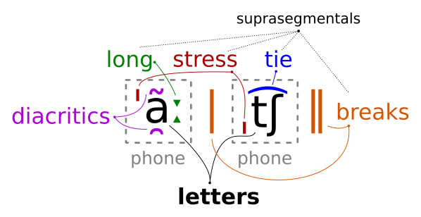

# Gruut IPA

Library for manipulating [International Phonetic Alphabet](https://en.wikipedia.org/wiki/International_Phonetic_Alphabet) (IPA) pronunciations.

Features include:

* Getting the category and details of a phone, e.g. "open front unrounded vowel" for ɶ
* Splitting IPA pronunciations into groups of:
    * Phones (`/ˈt͡ʃuːz/` to `ˈt͡ʃ uː z` )
    * Phonemes (`/kˈaʊ/` to `k ˈaʊ` for U.S. English)
* Converting pronunciations between:
    * IPA
    * [espeak](https://github.com/espeak-ng/)
    * [sampa](https://www.phon.ucl.ac.uk/home/sampa/)
    
Supported Languages:

* Arabic (`ar`)
* Czech (`cs-cz`)
* German (`de-de`)
* U.S. English (`en-us`)
* U.K. English (`en-gb`)
* Spanish (`es-es`)
* Persian/Farsi (`fa`)
* Spanish (`es-es`)
* Italian (`it-it`)
* Dutch (`nl`)
* Portuguese (`pt`)
* Russian (`ru-ru`)
* Swahili (`sw`)
    
## Installing

```sh
$ pip install gruut-ipa
```

## Dependencies

* Python 3.6 or higher

For command-line usage, you may also want:

* [espeak](https://github.com/espeak-ng/)
* [jq](https://stedolan.github.io/jq/)

Install these with:

```sh
$ sudo apt-get install espeak jq
```

## Phones and Phonemes



Phones in IPA are composed of different components:

* Letters
    * [Non-combining](https://en.wikipedia.org/wiki/Character_(computing)#Terminology) Unicode characters that represent a distinct human sound (phone)
* Suprasegmentals
    * [Non-combining](https://en.wikipedia.org/wiki/Character_(computing)#Terminology) Unicode characters that represent language features above individual vowels or consonants
    * Stress (ˈˌ), elongation (ː), linking/ties (t͡s), and short/long breaks (| ‖) are suprasegmentals
* Diacritics
    * [Combining characters](https://en.wikipedia.org/wiki/Combining_character) that provide additional information about a phone's pronunciation, such as [nasalation](https://en.wikipedia.org/wiki/Nasalization)
    
See [IPA Chart](https://www.ipachart.com/) for more details.

### Phonemes

While phones represent individual sounds, phonemes are the phonetic units of a language that meaningfully distinguish words. A phoneme may be realized by many different phones. For example, the `/r/` in [Standard German](https://en.wikipedia.org/wiki/Standard_German_phonology) can be realized as a uvular fricative (χ/ʁ), a uvular approximant (ɹ), or a uvular tap or trill (ʀ/r).

A phoneme may also be composed of multiple phones, such as the [dipthong](https://en.wikipedia.org/wiki/Diphthong) `aʊ` in U.S. English (the "ow" in "cow").

Supported languages in `gruut-ipa` contain a `phonemes.txt` file in the `gruut_ipa/data` directory. This file has the following format:

```text
<phoneme> <example> [<replace> ...]
```

where `<phoneme>` is a set of IPA letters, like `ɶ` or `aʊ`. The `<example>` is a word whose pronunciation contains the `<phoneme>`. After that, there are one or more optional `<replace>` strings that will be replaced with `<phoneme>`. The German `/r/` example from above might be represented as:

```text
r brot χ ʁ ɹ ʀ
```

Phonemes for a given language come from [phonological analyses](https://en.wikipedia.org/wiki/Template:Language_phonologies) and from [public databases](https://phoible.org/). Ultimately, they are geared towards capturing pronunciations from [Wiktionary](https://www.wiktionary.org/).
 
## Usage

Print JSON information about phones:

```sh
$ python3 -m gruut_ipa describe "ˈãː" | jq .
{
  "text": "ˈãː",
  "letters": "a",
  "stress": "primary",
  "height": "open",
  "placement": "front",
  "rounded": false,
  "type": "Vowel",
  "nasalated": true,
  "elongated": true
}
```

Split an IPA pronunciation into phones:

```sh
$ python3 -m gruut_ipa phones "ˈjɛs|ˈt͡ʃuːz aɪpiːeɪ‖"
ˈj ɛ s | ˈt͡ʃ uː z a ɪ p iː e ɪ ‖
```

Group phones into phonemes for a specific language:

```sh
$ python3 -m gruut_ipa phonemes en-us "/dʒʌst ə kaʊ/"
d͡ʒ ʌ s t ə k aʊ
```

Convert between IPA, [espeak](https://github.com/espeak-ng/), and [sampa](https://www.phon.ucl.ac.uk/home/sampa/):

```sh
$ python3 -m gruut_ipa convert ipa espeak "mʊmˈbaɪ"
[[mUm'baI]]

$ python3 -m gruut_ipa convert espeak ipa "[[D,Is Iz sVm f@n'EtIk t'Ekst 'InpUt]]"
ðˌɪs ɪz sʌm fɘnˈɛtɪk tˈɛkst ˈɪnpʊt
```

Chain commands together:

```sh
$ python3 -m gruut_ipa convert espeak ipa "[[k'aU]]" | \
    python3 -m gruut_ipa phonemes en-us --keep-stress
k ˈaʊ
```

### Alternative Phoneme Sets

Some languages have multiple phoneme sets available:

* U.S. English (`en-us`)
    * CMUDict (`en-us/cmudict`)
    * [Zamia](https://github.com/gooofy/zamia-speech) (`en-us/zamia`)
* Swahili (`sw`)
    * [ALFFA](http://alffa.imag.fr/) (`sw/alffa`)
    
Convert from IPA to alternative phoneme set:

```sh
$ python3 -m gruut_ipa convert ipa en-us/cmudict "h ɛ l ˈoʊ w ˈɚ l d"
HH EH0 L OW1 W ER1 L D
```

Convert from alternative phoneme set to IPA:

```sh
$ python3 -m gruut_ipa convert en-us/cmudict ipa "HH EH0 L OW1 W ER1 L D"
h ɛ l ˈoʊ w ˈɚ l d
```

## Scripts

Use the `speak-ipa` script to have [espeak](https://github.com/espeak-ng/) pronounce IPA. You may need to `apt-get install espeak` first.

```sh
$ echo '/hɛloʊ wɝld/' | bin/speak-ipa en-us -s 60 -w 'hello world.wav'
$ aplay 'hello world.wav'
```

## Phones

Supported IPA phones can be printed with:

```sh
$ python3 -m gruut_ipa print
{"text": "i", "letters": "i", "stress": "none", "height": "close", "placement": "front", "rounded": false, "type": "Vowel", "nasalated": false, "elongated": false, "description": "close front unrounded vowel", "espeak": "i", "sampa": "i"}
{"text": "y", "letters": "y", "stress": "none", "height": "close", "placement": "front", "rounded": true, "type": "Vowel", "nasalated": false, "elongated": false, "description": "close front rounded vowel", "espeak": "y", "sampa": "y"}
...
```

A nice table can be generated with [jq](https://stedolan.github.io/jq/):

```sh
$ python3 -m gruut_ipa print | \
    jq -r '. | "\(.text)\t\(.espeak)\t\(.sampa)\t\(.description)"'
```

Converted to Markdown:

| IPA  | eSpeak | Sampa   | Description                           |
| ---- | -----  | ------- | -----------------------------------   |
| i    | i      | i       | close front unrounded vowel           |
| y    | y      | y       | close front rounded vowel             |
| ɨ    | i"     | 1       | close central unrounded vowel         |
| ʉ    | u"     | }       | close central rounded vowel           |
| ɯ    | u-     | M       | close back unrounded vowel            |
| u    | u      | u       | close back rounded vowel              |
| ɪ    | I      | I       | near-close near-front unrounded vowel |
| ʏ    | I.     | Y       | near-close near-front rounded vowel   |
| ʊ    | U      | U       | near-close near-back rounded vowel    |
| e    | e      | e       | close-mid front unrounded vowel       |
| ø    | Y      | 2       | close-mid front rounded vowel         |
| ɘ    | @      | @\\     | close-mid central unrounded vowel     |
| ɵ    | @.     | 8       | close-mid central rounded vowel       |
| ɤ    | o-     | 7       | close-mid back unrounded vowel        |
| o    | o      | o       | close-mid back rounded vowel          |
| ɛ    | E      | E       | open-mid front unrounded vowel        |
| œ    | W      | 9       | open-mid front rounded vowel          |
| ɜ    | V"     | 3       | open-mid central unrounded vowel      |
| ɞ    | O"     | 3\\     | open-mid central rounded vowel        |
| ʌ    | V      | V       | open-mid back unrounded vowel         |
| ɔ    | O      | O       | open-mid back rounded vowel           |
| æ    | a      | {       | near-open front unrounded vowel       |
| ɐ    | V      | 6       | near-open central unrounded vowel     |
| a    | a      | a       | open front unrounded vowel            |
| ɶ    | W      | &       | open front rounded vowel              |
| ɑ    | A      | A       | open back unrounded vowel             |
| ɒ    | A.     | Q       | open back rounded vowel               |
| m    | m      | m       | voiced bilabial nasal                 |
| ɱ    | M      | F       | voiced labio-dental nasal             |
| n    | n      | n       | voiced alveolar nasal                 |
| ɳ    | n.     | n\`     | voiced retroflex nasal                |
| ŋ    | N      | N       | voiced velar nasal                    |
| ɴ    | n"     | N\\     | voiced uvular nasal                   |
| p    | p      | p       | voiceless bilabial plosive            |
| b    | b      | b       | voiced bilabial plosive               |
| t    | t      | t       | voiceless alveolar plosive            |
| d    | d      | d       | voiced alveolar plosive               |
| ʈ    | t.     | t\`     | voiceless retroflex plosive           |
| ɖ    | d.     | d\`     | voiced retroflex plosive              |
| c    | c      | c       | voiceless palatal plosive             |
| ɟ    | J      | J\\     | voiced palatal plosive                |
| k    | k      | k       | voiceless velar plosive               |
| ɡ    | g      | g       | voiced velar plosive                  |
| g    | g      | g       | voiced velar plosive                  |
| q    | q      | q       | voiceless uvular plosive              |
| ɢ    | G      | G\\     | voiced uvular plosive                 |
| ʡ    |        | >\\     | voiceless pharyngeal plosive          |
| ʔ    | ?      | ?       | voiceless glottal plosive             |
| p͡f   | pf     | pf      | voiceless labio-dental affricate      |
| b͡v   | bv     | bv      | voiced dental affricate               |
| t̪͡s   | ts     | t_ds    | voiceless dental affricate            |
| t͡s   | ts     | ts      | voiceless alveolar affricate          |
| d͡z   | dz     | dz      | voiced alveolar affricate             |
| t͡ʃ   | tS     | tS      | voiceless post-alveolar affricate     |
| d͡ʒ   | dZ     | dZ      | voiced post-alveolar affricate        |
| ʈ͡ʂ   | tS     | ts\`    | voiceless retroflex affricate         |
| ɖ͡ʐ   | dz     | dz\`    | voiced retroflex affricate            |
| t͡ɕ   | tS;    | ts\\    | voiceless palatal affricate           |
| d͡ʑ   | dZ;    | dz\\    | voiced palatal affricate              |
| k͡x   | k      | k_x     | voiceless velar affricate             |
| ɸ    | F      | p\\     | voiceless bilabial fricative          |
| β    | B      | B       | voiced bilabial fricative             |
| f    | f      | f       | voiceless labio-dental fricative      |
| v    | v      | v       | voiced labio-dental fricative         |
| θ    | T      | T       | voiceless dental fricative            |
| ð    | D      | D       | voiced dental fricative               |
| s    | s      | s       | voiceless alveolar fricative          |
| z    | z      | z       | voiced alveolar fricative             |
| ʃ    | S      | S       | voiceless post-alveolar fricative     |
| ʒ    | Z      | Z       | voiced post-alveolar fricative        |
| ʂ    | s.     | s\`     | voiceless retroflex fricative         |
| ʐ    | z.     | z\`     | voiced palatal fricative              |
| ç    | C      | C       | voiceless palatal fricative           |
| x    | x      | x       | voiceless velar fricative             |
| ɣ    | Q      | G       | voiced velar fricative                |
| χ    | X      | X       | voiceless uvular fricative            |
| ʁ    | g"     | R       | voiced uvular fricative               |
| ħ    | H      | X\\     | voiceless pharyngeal fricative        |
| h    | h      | h       | voiceless glottal fricative           |
| ɦ    | h<?>   | h\\     | voiced glottal fricative              |
| w    | w      | w       | voiced bilabial approximant           |
| ʋ    | v#     | v\\     | voiced labio-dental approximant       |
| ɹ    | r      | r\\     | voiced alveolar approximant           |
| ɻ    | r.     | r\\\`   | voiced retroflex approximant          |
| j    | j      | j       | voiced palatal approximant            |
| ɰ    | Q      | M\\     | voiced velar approximant              |
| ⱱ    | ⱱ      | ⱱ       | voiced labio-dental flap              |
| ɾ    | *      | 4       | voiced alveolar flap                  |
| ɽ    | *.     | r\`     | voiced retroflex flap                 |
| ʙ    | b<trl> | B\\     | voiced bilabial trill                 |
| r    | r<trl> | r       | voiced alveolar trill                 |
| ʀ    | r"     | R\\     | voiced uvular trill                   |
| l    | l      | l       | voiced alveolar lateral-approximant   |
| ɫ    | l      | 5       | voiced alveolar lateral-approximant   |
| ɭ    | l.     | l\`     | voiced retroflex lateral-approximant  |
| ʎ    | l^     | L       | voiced palatal lateral-approximant    |
| ʟ    | L      | L\\     | voiced velar lateral-approximant      |
| ə    | @      | @       | schwa                                 |
| ɚ    | 3      | @\`     | r-coloured schwa                      |
| ɝ    | 3      | @\`     | r-coloured schwa                      |
| ɹ̩    | r-     | r\\̩     | voiced alveolar approximant           |

If you see anything wrong or missing, please let me know.
